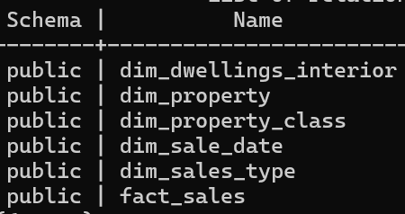
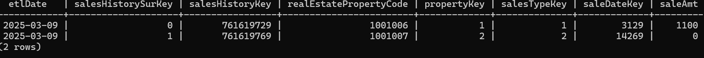

# Arlington Property Sales Data Engineering
## Overview
This project collects the Arlington County's [real estate data](https://data.arlingtonva.us/home) and build a data pipeline that extract, transform, and load data into data warehouse for property sales analysis since 1980s. Read more about the project on [my blog](https://medium.com/@binchen4568/building-an-end-to-end-data-pipeline-for-arlington-property-sales-16d8b79ec379)

## Architecture


## ELT Explaination:
1. the data is ingested and stored separately in landing zone(archive and recovery area) and working zone(for transformation/intermediate layer downstream)
2. the data is transformed by remove duplicates,change data type, and create surrogate key for each dimension table, once dimension table is built, the fact table would join by the surrogate key
3. data is loaded into postgres database 
4. dbt builds models and tests for the quality of data base on column level
5. the validated data is migrate to duckdb(columnar-oriented) for analysis

## Prerequiste
    - install docker 
    - Create an AWS account and create IAM User with access to S3
 
## Project Structure
```text
├── Dockerfile
├── airflow
│   └── dags
│       └── dag.py
├── docker-compose.yml
└── src
    ├── api_ingestion.py
    ├── dimension_handler.py
    ├── duckdb_migrate.py
    ├── init.sql
    ├── main.py
    ├── postgres.py
    ├── s3_storage.py
    ├── template.yml
    ├── transformation.py
```
## DAG


## Star Schema



