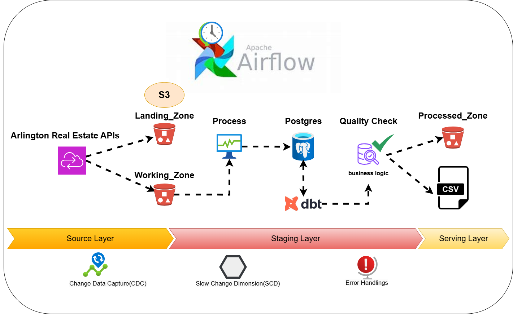

# Project Title: Arlington Property Sales Data Engineering
## Overview
This project focuses on the data engineering aspects of Arlington County's property sales data. The goal is to build a robust data pipeline that ingests, processes, and transforms property sales data for analysis and reporting.
## Architecture

## Project Structure
```text
Arlington-Property-Sales/
├── airflow/
│ ├── dags/
│ │ ├── dag.py # Main DAG file for orchestration
│ └── airflow.cfg # Airflow configuration file
├── data/
│ └── full_denormed_table.csv #final output
├── dbt_transformation/ # DBT models and tests
├── elt_logs/ # metadata produce during etl
│ ├── api.log
│ └── transformation.log
└── src/
├── api_ingestion.py 
├── main.py
├── postgres.py
├── s3_storage.py
└── transformation.py
