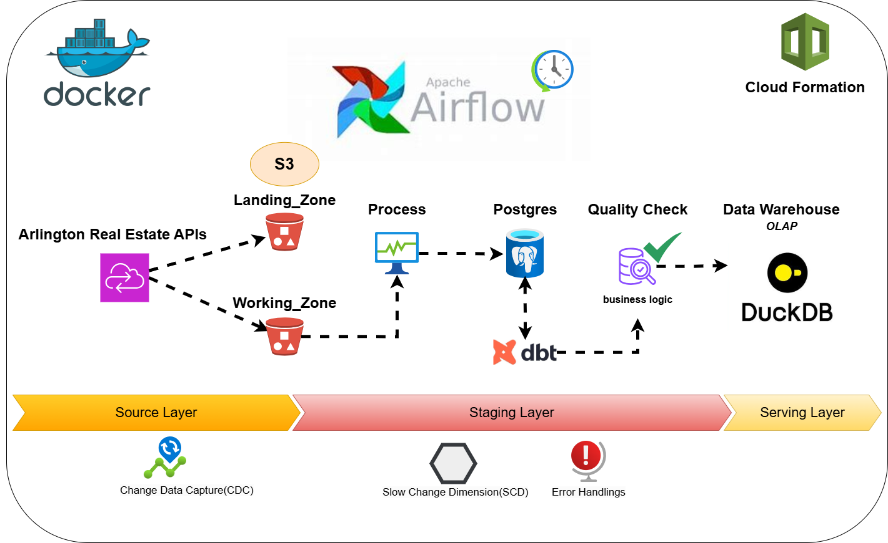

# Arlington Property Sales Data Engineering
## Overview
This project collects the Arlington County's real estate data and build a data pipeline that extract, transform, and load data into data warehouse for property sales analysis since 1980s. Read more about the project on [my blog](https://medium.com/@binchen4568/building-an-end-to-end-data-pipeline-for-arlington-property-sales-16d8b79ec379)
## Architecture

## Project Structure
```text
Arlington-Property-Sales/
├── airflow/
│ ├── dags/
│ │ ├── dag.py # Main DAG file for orchestration
│ └── airflow.cfg # Airflow configuration file
├── data/
│ └── full_denormed_table.csv #final output
├── dbt_transformation/ # DBT models and tests
├── elt_logs/ # metadata produce during etl
│ ├── api.log
│ └── transformation.log
└── src/
├── api_ingestion.py 
├── main.py
├── postgres.py
├── s3_storage.py
└── transformation.py
```
## DAG


## Star Schema


## ELT Explaination:
1. the data is ingested and stored separately in landing zone(archived and recovery area) and working zone(for transformation downstream)
2. the data is transformed by remove duplicates,change data type, and construct surrogate key for each dimension table, once dimension table is built, the fact table would join by the surrogate key
3. data is loaded into postgres database 
4. dbt would build models and test for the quality of data base on column level, with custom logics for the final aggregated table
5. the final aggregated table is exported to csv file and processing zone

